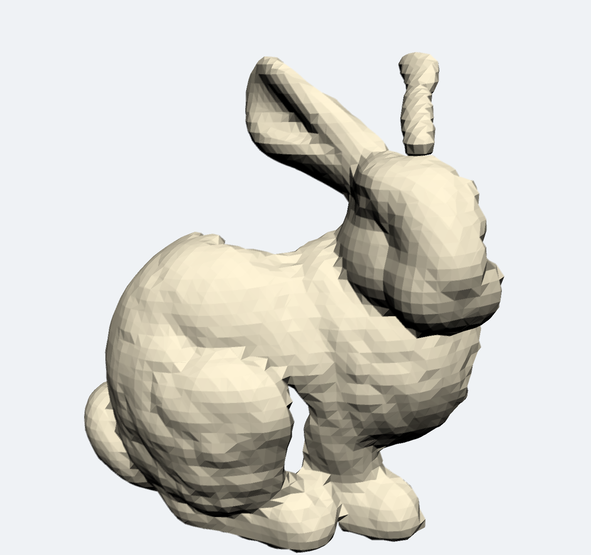

<!-- PROJECT SHIELDS -->
<!--
*** I'm using markdown "reference style" links for readability.
*** Reference links are enclosed in brackets [ ] instead of parentheses ( ).
*** See the bottom of this document for the declaration of the reference variables
*** for contributors-url, forks-url, etc. This is an optional, concise syntax you may use.
*** https://www.markdownguide.org/basic-syntax/#reference-style-links
-->
[![Contributors][contributors-shield]][contributors-url]
[![Forks][forks-shield]][forks-url]
[![Stargazers][stars-shield]][stars-url]
[![Issues][issues-shield]][issues-url]
[![MIT License][license-shield]][license-url]
[![LinkedIn][linkedin-shield]][linkedin-url]

<!-- PROJECT LOGO -->
 

  

  <h3 align="center">AR Voxel Engine Unity</h3>
  <h4 align="center">Msc FT Computer Science Individual Project</h4>
  

    Environment Reconstruction and Real-Time Editing Within Augmented Reality
     
     
    <a href="https://github.com/michaelcruzcervera/ARVoxelEngineUnity/issues">Report Bug</a>
    ·
    <a href="https://github.com/michaelcruzcervera/ARVoxelEngineUnity/issues">Request Feature</a>
  

<!-- TABLE OF CONTENTS -->
## Table of Contents

* [About the Project](#about-the-project)
  * [Built With](#built-with)
* [Surface Reconstruction](#surface-reconstruction)
  * [SDF Estimation](#sdf-estimation)
  * [Meshing](#meshing)
* [World](#world)
  * [LOD](#lod)
* [Editing](#editing)
* [Roadmap](#roadmap)
* [Acknowledgements](#acknowledgements)
* [References](#references)

<!-- ABOUT THE PROJECT -->
## About The Project

  

       
       
      
  

  
Augmented Reality (AR) technology is constantly evolving, with notable recent improvements in standalone headsets and perhaps most interestingly, mobile devices. Considering the potential of AR within gaming and interactive media, the importance of scaling down to more accessible lower cost interfaces is a vital topic of research. Mixing the digital and physical can result in immersive, unique experiences. With the standard of AR development tool-kits being so high it is easier than ever to release AR applications. Without the heavy costs of standalone headsets, mobile AR is making a splash in the industry.

These AR experiences change massively depending on the user’s environment. One of the goals of this project was how these differences in the user’s environment could be used to create unique and immersive experiences. 

By using feature points within the environment, the environment can be reconstructed digitally, taking advantage of the user’s unique space. The user can then sculpt and interact with the resulting mesh in a similar way as VR solutions like Oculus Medium (2016), but with a lower barrier of entry.

Reconstruction of environments from tracked point data is a well researched area, but commercial solutions are generally limited to devices with specialised sensors such as the iPad pro and standalone AR headsets. This project aims to explore real-time meshing and reconstruction in Augmented Reality in a more accessible way which does not require specialised sensors but simply a mobile phone. I first elaborate on the relevant research into the respective fields, then define the project plan as well as the requirements of the system, and finally elaborate on the implementation and results of the AR mobile application.

### Built With

* [Unity](https://unity.com/)
* [ARFoundation](https://unity.com/unity/features/arfoundation)
* [C# Job System](https://docs.unity3d.com/Manual/JobSystem.html)

## Surface Reconstruction

### SDF Estimation

  

   
   
   
   
   
    
  

### Meshing 

  

   
   
  

  
## World

  

   
   
  

### LOD

  

   
   
     
  

## Editing

  

   
   
  

<!-- ROADMAP -->
## Roadmap

<!-- ACKNOWLEDGEMENTS -->
## Acknowledgements
* [KNN Library by ArthurBrussee](https://github.com/ArthurBrussee/KNN)
* [The Stanford 3D Scanning Repository](http://graphics.stanford.edu/data/3Dscanrep/)
* [Ultimate 10+ Shaders](https://assetstore.unity.com/packages/vfx/shaders/ultimate-10-shaders-168611)
* [Freepik](https://www.flaticon.com/authors/freepik)
* [Pixelmeetup](https://www.flaticon.com/authors/pixelmeetup)
* [Those Icons](https://www.flaticon.com/authors/those-icons)
* [Becris](https://www.flaticon.com/authors/becris)

## References
[1]  Bourke,P.(1994).Polygonisingascalarfield.http://paulbourke.net/geometry/polygonise/.
 
[2]  Lorensen,  W.  Cline,  H.  (1987).  Marching  Cubes:  A  High  Resolution3D  Surface  Construction  Algorithm.  Computer  Graphics,  21  (4),  pp.163-169.
 
[3]  D ̈urst,  M.J.,  (1988).  Additional  reference  to  “marching  cubes”(letters).Computer Graphics, 22(2), 72-73.
 
[4]  Lengyel, E. (2010).“Voxel-Based Terrain for Real-Time Virtual Simula-tions”. PhD diss., University of California at Davis.
 
[5]  Tao,  J.  Losasso,  F.  Schaefer,  S.  Warren,  J.  (2002).Dual  Contouring  ofHermite Data. Rice University.
 
[6]  Schaefer, S. Tao, J. Warren, J. (2007). Manifold Dual Contouring. IEEETrans. Vis. Comput. Graph.
 
[7]  Berger,  M.  Tagliasacchi,  A.  Seversky,  L.  M.,  Alliez,  P.  Guennebaud,G.  Levine,  J.  A..  Sharf,  A.  Silva,  C.  T..  (2016).  A  Survey  of  SurfaceReconstruction from Point Clouds.
 
[8]  Hoppe,   H.   DeRose,   T.   Duchamp,   T.   McDonald,   J.   Stuetzle,   W.(1992).Surface  Reconstruction  from  Unorganised  Points.  University  ofWashington.
 
[9]  Geiss,  R.  (2007).  Chapter  1.  Generating  Complex  Procedural  TerrainsUsing the GPU, GPU Gems 3. Nvidia Corporation.

<!-- MARKDOWN LINKS & IMAGES -->
<!-- https://www.markdownguide.org/basic-syntax/#reference-style-links -->
[contributors-shield]: https://img.shields.io/github/contributors/othneildrew/Best-README-Template.svg?style=flat-square
[contributors-url]: https://github.com/michaelcruzcervera/ARVoxelEngineUnity/graphs/contributors
[forks-shield]: https://img.shields.io/github/forks/othneildrew/Best-README-Template.svg?style=flat-square
[forks-url]: https://github.com/michaelcruzcervera/ARVoxelEngineUnity/network/members
[stars-shield]: https://img.shields.io/github/stars/othneildrew/Best-README-Template.svg?style=flat-square
[stars-url]: https://github.com/michaelcruzcervera/ARVoxelEngineUnity/stargazers
[issues-shield]: https://img.shields.io/github/issues/othneildrew/Best-README-Template.svg?style=flat-square
[issues-url]: https://github.com/michaelcruzcervera/ARVoxelEngineUnity/issues
[license-shield]: https://img.shields.io/github/license/othneildrew/Best-README-Template.svg?style=flat-square
[license-url]: https://github.com/michaelcruzcervera/ARVoxelEngineUnity/blob/master/LICENSE.txt
[linkedin-shield]: https://img.shields.io/badge/-LinkedIn-black.svg?style=flat-square&logo=linkedin&colorB=555
[linkedin-url]: https://linkedin.com/in/michael-cruz-cervera
